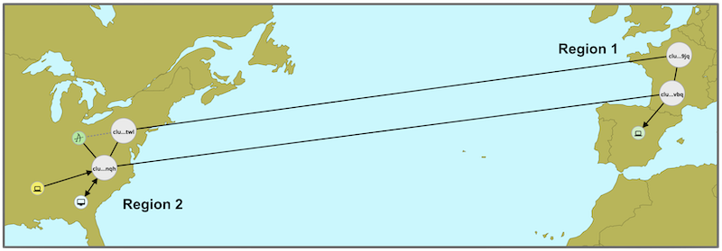

# Messaging Federation using *AMQ Interconnect*

## Introduction

Often organisations have multiple Data Centres across different geographical regions and would like to have them connected and running as if they were forming a single logical cluster.

In the world of messaging and using message brokers alone, this is a challenge difficult to overcome. However *AMQ Interconnect* (based on *Apache's QPid Dispatch Router*) introduces a very important building block that opens up new options.

This tutorial showcases how to deploy an *AMQ* messaging layer that federates two different *OpenShift* clusters using *AMQ Interconnect*. This allows different *AMQ* clients, connected to different data centres, to exchange messages unaware about the regional distance that separates them. 

### Highlights of the tutorial are:

- Use of *Operators* to deploy components
- Use of *Camel/Fuse* to easily implement *AMQP* Clients
- Use of *AMQ* brokers to enable asynchronous patterns.
- Secure *AMQ Interconnect* endpoints.

## Dependencies

1. *OpenShift* environments

	- 1 *OpenShift* v4.2 cluster as Region-1
	- 1 *OpenShift* v4.2 cluster as Region-2
	 
	
	To run this tutorial/demo you would ideally require to have two different *OpenShift* clusters available so that you can fully demonstrate how messaging traffic really jumps from one region to another. However, if you need to compromise in resources usage, there is a number of economy approaches you can take.

	Here below you have a set of proposed rates:

	- **First class**: Run 2 clusters in 2 real different *OpenShift* instances
	- **Business class**: Run a single *OpenShift* cluster, and simulate regions using *OpenShift* namespaces
	- **Economy class**: Run *OpenShift* only in your laptop
	 

	If you're on Economy, it is mostly recommended to use *CodeReady Containers* (CRC) to run your OCP environment in your laptop. It provides a working OCP v4.2 environment, with some capabilities off so that your laptop can still breathe. See the *CRC* documentation references given below for more details.

2. Java environment

	The *AMQ* clients (producers/consumers) will be implemented using *Red Hat Fuse*. All you need in your environment to run *Fuse* is:

	- Java (tested with 1.8)
	- Maven (tested with 3.6.0) 

## References

 - *AMQ Interconnect* documentation:
	 - official: \
   		https://access.redhat.com/documentation/en-us/red_hat_amq/7.5/html-single/deploying_amq_interconnect_on_openshift/index#creating-inter-cluster-router-network-router-ocp

	 

 - *CodeReady Containers*
	 - official: \
	 		https://access.redhat.com/documentation/en-us/red_hat_codeready_containers/1.4/html/getting_started_guide/index
	 - installer: \
	 		https://cloud.redhat.com/openshift/install/crc/installer-provisioned
	 - blogs: \
	 		https://computingforgeeks.com/setup-local-openshift-cluster-with-codeready-containers/ \
	 		https://haralduebele.blog/2019/09/13/red-hat-openshift-4-on-your-laptop/

 

# Chapters:

The tutorial is split in the following chapters: 

1. [Deploy *AMQ Interconnect* in Region-1](./docs/chapter1.md)
1. [Deploy *AMQ Interconnect* in Region-2](./docs/chapter2.md)
1. [Create *Fuse* clients (producer/consumer)](./docs/chapter3.md)
1. [Attach an AMQ Broker](./docs/chapter4.md)

 

---

Start from:  [Chapter 1)](./docs/chapter1.md)

