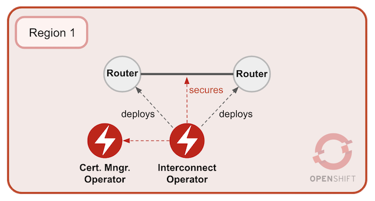

## Deploy *AMQ Interconnect* in Region-1

For this first section, you'll be working on Region-1, we call it `Cluster-1`. The picture below illustrates the deployment process you're about to perform. 





As above pictured, two different *Operators* are at play. The *AMQ Interconnect Operator* will deploy two nodes (Routers). Then it links them to form a mesh of size two and uses the *AMQ Certificate Manager* to secure the connection between both. 

While working with the instructions that follow, ensure you're logged in to the OCP environment corresponding to Region-1.

<br/>

1. #### Install *AMQ's Certificate Manager Operator*

	*AMQ Interconnect* forms a Routing Layer by linking multiple routing nodes as a mesh.

	Deploying *AMQ Interconnect* requires *AMQ's Certificate Manager Operator* to generate the security certificates to link nodes between each other.

	As an admin, navigate to:

	- Web Console ➡ Operators ➡ OperatorHub ➡ AMQ Certificate Manager ➡ Install ➡ Subscribe

	  (at the time of writing: v1.0.0)

	This will trigger a cluster wide installation. To view the running pod execute:

	   oc get pods -n openshift-operators

	>**Be patient:** this action may take some time as OpenShift needs to pull the Operator's image from a remote repository

	You should see something similar to:

	   NAME                                       READY   STATUS    RESTARTS   AGE
	   cert-manager-controller-7667b78746-gk7x9   1/1     Running   0          8m48s

<br/>

1. #### Install *AMQ's Interconnect Operator*


	As a standard user, create a new namespace, for example:

	   oc new-project amq-cluster1

	Install *AMQ's Interconnect Operator*:

	 - Web Console ➡ Operators ➡ OperatorHub ➡ AMQ Interconnect ➡ Install 

		(at the time of writing: v1.1.0)

	Select `amq-cluster1` as the target namespace, and click '*Subscribe*'.

	>**Be patient:** this action may take some time as OpenShift needs to pull the Operator's image from a remote repository.

	This will trigger the operator's installation. To view the running pod execute:

	   oc get pods -n amq-cluster1

	You should see something similar to:

	   NAME                                    READY   STATUS    RESTARTS   AGE
	   interconnect-operator-84f7fcc8b-2x225   1/1     Running   0          28s

<br/>

1. #### Deploy an *AMQ Interconnect* Routing layer

    Once the *Operators* are running, deploy the *Interconnect* nodes:

	From namespace `amq-cluster1` navigate to:

	 - Operators ➡ Installed Operators ➡ AMQ Interconnect ➡ AMQ Interconnect ➡ Create Interconnect
	
	>**Note:** the default YAML content defines an *Interconnect* of `size 2` which indicates the *Operator* to deploy 2 linked router nodes.

	Review the default YAML definition and update the following:

	```yaml
	metadata: name: cluster1-router-mesh
	```

	The YAML should include 2 routes and look as follows:

    ```yaml
    apiVersion: interconnectedcloud.github.io/v1alpha1
    kind: Interconnect
    metadata:
      name: cluster1-router-mesh
      namespace: amq-cluster1
    spec:
      deploymentPlan:
        size: 2
        role: interior
        placement: Any
    ```

	Click `Create` to kick off the installation. To view the running pods corresponding to the *Interconnect* nodes execute:

	   oc get pods -n amq-cluster1

	You should see something similar to:

	```
	NAME                                    READY   STATUS    RESTARTS   AGE
	cluster1-router-mesh-f6c95f58f-jl5mv    1/1     Running   0          68s
	cluster1-router-mesh-f6c95f58f-mh6pd    1/1     Running   0          68s
	interconnect-operator-84f7fcc8b-2x225   1/1     Running   0          17m
	```
	We will assume at this point that both *Interconnect* nodes are correctly linked and they already form by themselves a mesh of 2 nodes.

	> Note: in a later section you will learn how to open Interconnect's web console to visually validate the mesh is well formed. 

<br/>

1. #### Expose *AMQPS* port

	The tutorial guides you on how to connect external clients to *Interconnect*. To enable external connectivity we need to expose the listener's port so that external clients can connect to produce/consume messages.

	


	From namespace `amq-cluster1` navigate to:

	- Web Console ➡ Operators ➡ Installed Operators ➡ AMQ Interconnect ➡ AMQ Interconnect ➡ cluster1-router-mesh ➡ YAML

	>**Note:** the default AMQPS port is `5671` which is the one to expose.

	Review the default YAML definition:

	```yaml
	spec: listeners: - port 5671
	```

	Include the parameter `expose: true`. You should see the following:

	```yaml
	    - port: 5671
          sslProfile: default
          expose: true
	```
	Click `Save`. The operator watching the cluster should trigger the creation of a route pointing to the exposed port:

	   cluster1-router-mesh-5671

	>**Note:** for now we won't make use of it, until both regions are fully deployed and we then point our AMQP clients to this AMQPS port to send traffic.


<br/>

1. #### Create Certificate to link both clusters

	*Region-1* is now operational. Region-2 is pending to be deployed and connected to Region-1. The cross-region link will need to be secured, and for that we need to generate a certificate Region-2 will use.

	Define a Certificate YAML file `certificate-request.yaml` to generate a certificate:

	```yaml
	apiVersion: certmanager.k8s.io/v1alpha1
	kind: Certificate
	metadata:
	  name: cluster2-inter-router-tls
	spec:
	  commonName: cluster1-router-mesh-myproject.cluster2.openshift.com
	  issuerRef:
	    name: cluster1-router-mesh-inter-router-ca
	  secretName: cluster2-inter-router-tls
	```

	Create the Certificate in Openshift:

	   oc apply -f certificate-request.yaml -n amq-cluster1

	Extract the certificate:

	```
	mkdir cluster2-inter-router-tls
	oc extract secret/cluster2-inter-router-tls --to=cluster2-inter-router-tls
	```

	Keep the extracted certificate at hand when deploying Region-2 later in the tutorial.

<br/>

1. #### Obtain the route URL for inter-router connections.

	When *Interconnect* was deployed by the *Operator* it also exposed the inter-router port to allow other external *Interconnect* nodes to link to this cluster.

	The inter-router port is internal to *Interconnect* and only used to link new router nodes to the mesh.
	
	>**Note:** the default inter-router port is `55671` which is the one already exposed.

	We need to obtain its route URL so that we can configure `Cluster-2` to connect to this cluster.

	Execute the following command:

	   oc get route cluster1-router-mesh-55671 -o=jsonpath={.spec.host}

	Keep the URL value at hand, we will configure the second cluster with it.

	If you're using *CodeReady Containers* (CRC) as your *OpenShift* environment, the obtained URL should look like:

	   cluster1-router-mesh-55671-amq-cluster1.apps-crc.testing


</br>

---


Click the link to the [Next](./chapter2.md) chapter when ready. 
