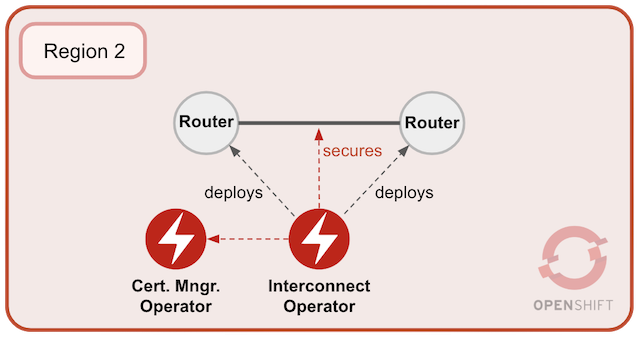
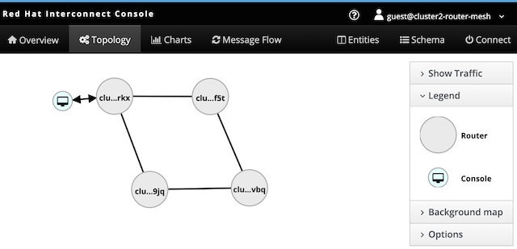

## Deploy *AMQ Interconnect* in Region-2

In this second chapter, you'll be working on Region-2, we call it `Cluster-2`. The picture below illustrates the deployment process you're about to perform. 





As above pictured and similarly done for Region-1, two different *Operators* are at play. The *AMQ Interconnect Operator* will deploy two nodes (Routers). Then it links them to form a mesh of size two and uses the *AMQ Certificate Manager* to secure the connection between both. 

While working with the instructions that follow, ensure you're logged in to the OCP environment corresponding to Region-2.

<br/>


1. #### Create Secret from Cluster-1's certificate

	First, create the new Cluster-2 namespace, for example:

	   oc new-project amq-cluster2

	Then, from the same folder location where you obtained the Certificate, create the *Secret* with:

	   oc create secret generic cluster2-inter-router-tls --from-file=cluster2-inter-router-tls

<br/>

1. #### Install *AMQ's Certificate Manager Operator*

	>**Note**: if you're on Economy class, and you're using the same *OpenShift* environment to simulate both regions, *AMQ's Certificate Manager Operator* should already be available, you can ignore this section. Complete the instructions below otherwise.

	As previously done for Cluster-1, as an admin user, navigate to:

	 - Web Console ➡ Operators ➡ OperatorHub ➡ AMQ Certificate Manager ➡ Install ➡ Subscribe

		(at the time of writing: v1.0.0)

	This will trigger a cluster wide installation. To view the running pod execute:

	   oc get pods -n openshift-operators

	>**Be patient:** this action may take some time as *OpenShift* may need to pull the *Operator*'s image from a remote repository

	You should see something similar to:

	```
	NAME                                       READY   STATUS    RESTARTS   AGE
	cert-manager-controller-7667b78746-gk7x9   1/1     Running   0          8m48s
	```

<br/>

1. #### Install *AMQ's Interconnect Operator*

	Install *AMQ's Interconnect Operator*:

	- Web Console ➡ Operators ➡ OperatorHub ➡ AMQ Interconnect ➡ Install 

		(at the time of writing: v1.1.0)

	Select `amq-cluster2` as the target namespace, and click '*Subscribe*'.

	>**Be patient:** this action may take some time as *OpenShift* may need to pull the *Operator*'s image from a remote repository.

	This will trigger the operator's installation. To view the running pod execute:

	   oc get pods -n amq-cluster2

	You should see something similar to:
	```
	NAME                                    READY   STATUS    RESTARTS   AGE
	interconnect-operator-84f7fcc8b-2x225   1/1     Running   0          28s
	```

<br/>


1. #### Deploy an *Interconnect* Routing layer

	Once the operators running, deploy the Interconnect nodes:

	From namespace `amq-cluster2`:

	- Operators ➡ Installed Operators ➡ AMQ Interconnect ➡ AMQ Interconnect ➡ Create Interconnect

	>**Note:** the default YAML content defines an *Interconnect* of `size 2` which indicates the *Operator* to deploy 2 linked router nodes.
	
	Review the default YAML definition and update the following:

	```yaml
	metadata: name: cluster2-router-mesh
	spec: sslProfiles: (view sample below)
	spec: interRouterConnectors: (view sample below)
	```

	The YAML should include 2 Routers and look as follows:

	```yaml
	apiVersion: interconnectedcloud.github.io/v1alpha1
	kind: Interconnect
	metadata:
	  name: cluster2-router-mesh
	  namespace: amq-cluster2
	spec:
	  deploymentPlan:
	    size: 2
	    role: interior
	    placement: Any
	  sslProfiles:
	  - name: inter-cluster-tls
	    credentials: cluster2-inter-router-tls
	    caCert: cluster2-inter-router-tls
	  interRouterConnectors:
	  - host: [HERE THE URL TO CLUSTER-1 PORT 55671]
	    port: 443
	    verifyHostname: false
	    sslProfile: inter-cluster-tls
	```

	>**Important:**
		Ensure the field's `host` URL is configured with the Route URL you kept from Cluster-1.

	**Example**:
	 - if Cluster-1 was deployed in a *CodeReady Containers* *OpenShift* environment, the field `host` would contain a value similar to:

    	```yaml
	      - host: cluster1-router-mesh-55671-amq-cluster1.apps-crc.testing
	    ```

	Click '*Create*' to kick off the installation. To view the running pods corresponding to the *Interconnect* nodes execute:

	   oc get pods -n amq-cluster2

	You should see something similar to:

	```
	NAME                                     READY   STATUS    RESTARTS   AGE
	cluster2-router-mesh-594f87df49-gm6zr    1/1     Running   0          2m34s
	cluster2-router-mesh-594f87df49-tjfpj    1/1     Running   0          2m34s
	interconnect-operator-5bdb444f96-ks9ct   1/1     Running   0          32m
	```

	> Note: later in this chapter you will open *Interconnect*'s web console to visually validate the mesh is well formed. 

<br/>


1. #### Expose AMQPS port

	As previously done for Cluster-1, we need to expose the listener's port so that external clients can connect to produce/consume messages.

	

	From namespace `amq-cluster2` navigate to:

	- Web Console ➡ Operators ➡ Installed Operators ➡ AMQ Interconnect ➡ AMQ Interconnect ➡ cluster2-router-mesh ➡ YAML

	>**Note:** the default AMQPS port is `5671` which is the one to expose.

	Review the default YAML definition:

	```yaml
	spec: listeners: - port 5671
	```

	Include the parameter `expose: true`. You should see the following:

	```yaml
	    - port: 5671
          sslProfile: default
          expose: true
	```
	
	Click `Save`. The operator watching the cluster should trigger the creation of a route pointing to the exposed port:

	   cluster2-router-mesh-5671

	Obtain the route's URL so that we can configure external clients to access *Interconnect*. Run the following command:

	   oc get route cluster2-router-mesh-5671 -o=jsonpath={.spec.host}

	Take note of the URL to configure *Fuse* later in the tutorial.

</br>

## Validate deployments

After deploying both clusters and link them together, it is a good idea to get a visual using *Interconnect*'s web console. To open the console, follow the instructions below.

From namespace `amq-cluster2`, navigate to:

 - Web Console ➡ Networking ➡ Routes

And click on the *HTTPS* link associated with the route `cluster2-router-mesh-8080` which should open *Interconnet*'s console and present connection parameters.

Use the following parameter values:

 - Address: (default is valid)
 - Port: `443`
 - User name:
		`guest@cluster2-router-mesh`
 - Password:
		secret password (see below)

You can obtain the password from the *Secret* generated by the *Operator*, run the following command:

- linux:

	  oc get secret cluster2-router-mesh-users -o=jsonpath={.data.guest} | base64 -d

- macos:
		
	  oc get secret cluster2-router-mesh-users -o=jsonpath={.data.guest} | base64 -D

Click '*Connect*'.

Once connected you should see listed 4 different routers, corresponding to the a pair from `Cluster-1` and the pair from `Cluster-2`.

The *Topology* tab should render how both clusters are linked together to form a single *Routing Layer* mesh.



The picture above illustrates 4 Router nodes (in grey), and the client console (in blue) connected to the network that allows us to visualise the Mesh.

The bottom 2 Router nodes correspond to Region-1, and the 2 Router nodes on top correspond to Region-2 where the console is connected.

Note the following facts:
 - both Region-1 nodes are inter-connected (botton horizontal line) 
 - both Region-2 nodes are inter-connected (top horizontal line)
 - Each Region-2 Router node inter-connects to one Region-1 Router node.

An important observation to do in the picture above is that the cross-region links (vertical lines) have been load-balanced by Region-1, the connections have been distributed. However both cross-region connections could have landed into the same Region-1 Router node.
</br>

---


Click the link to the [Next](./chapter3.md) chapter when ready. 