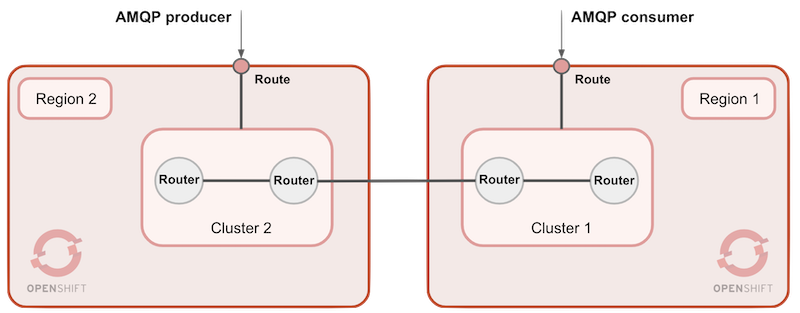

# Create AMQP clients

Our Federated *AMQ Interconnect* deployment has been completed, and you've visually validated all the expected Router nodes are connected. All there's left to do is to inject a data flow in the routing layer and see how messages cross from one region to another.

The chapter below will help you to build an *AMQP* producer using *Fuse* that connects to Region-2 and starts sending *AMQP* messages. On Region-1 you will connect an *AMQP* consumer to receive the messages, also built with Fuse.



Above you see how the AMQP producer is connected to Region-2, from where messages will be sent, and an AMQP consumer, connected in Region-1, collecting the messages.

<br/>

## Create a *Fuse* client producer

We will use *Fuse* to create an *AMQP* producer to send messages over the *Interconnect* layer. The producer will connect to Cluster-2 to send messages.

Create a *Fuse* project skeleton using the following *Maven* command:

```
mvn org.apache.maven.plugins:maven-archetype-plugin:2.4:generate \
-DarchetypeCatalog=https://maven.repository.redhat.com/ga/io/fabric8/archetypes/archetypes-catalog/2.2.0.fuse-740017-redhat-00003/archetypes-catalog-2.2.0.fuse-740017-redhat-00003-archetype-catalog.xml \
-DarchetypeGroupId=org.jboss.fuse.fis.archetypes \
-DarchetypeArtifactId=spring-boot-camel-xml-archetype \
-DarchetypeVersion=2.2.0.fuse-740017-redhat-00003
```

With coordinates:

	'groupId': org.demo
	'artifactId': producer
	'version': 1.0.0

Add in the POM file the following dependency:

```xml
<dependency>
	<groupId>org.apache.camel</groupId>
	<artifactId>camel-amqp</artifactId>
</dependency>	
```

Add Configuration:

- Point the configuration of this producer to `Cluster-2`.

  For instance, a sample `application.properties` should look similar to the configuration below, where the URL points to Cluster-2 running in CRC:

	```properties
	# AMQP connectivity
	amqp.uri=amqps://cluster2-router-mesh-5671-amq-cluster2.apps-crc.testing:443?transport.trustAll=true&jms.sendTimeout=10000&amqp.saslMechanisms=PLAIN
	amqp.username=guest@cluster2-router-mesh
	amqp.password=sGZqNMFk
	```

  >**Note**: the authentication mechanism is SASL Plain, via TLS. The user/password in this configuration would be the same defaults used to access *Interconnect*'s console.

	Reminders:
	- you can obtain the URL to AMQP's port in Cluster-2 running:

	      oc get route cluster2-router-mesh-5671 -o=jsonpath={.spec.host}

	- you can obtain the `guest`'s password as follows:

	  linux:

		  oc get secret cluster2-router-mesh-users -o=jsonpath={.data.guest} | base64 -d

	  macos:
				
		  oc get secret cluster2-router-mesh-users -o=jsonpath={.data.guest} | base64 -D


		


Add Connection and Routes

 - Spring XML:

	```xml
		<!-- AMQP connectivity -->
		<bean id="jmsConnectionFactory"
			class="org.apache.qpid.jms.JmsConnectionFactory"
			primary="true">
				<property name="remoteURI" value="${amqp.uri}" />
				<property name="username" value="${amqp.username}" />
				<property name="password" value="${amqp.password}" />
		</bean>
		<bean id="jmsCachingConnectionFactory"
			class="org.springframework.jms.connection.CachingConnectionFactory">
				<property name="targetConnectionFactory" ref="jmsConnectionFactory" />
		</bean>
		<bean id="jmsConfig"
			class="org.apache.camel.component.jms.JmsConfiguration" >
				<constructor-arg ref="jmsCachingConnectionFactory" /> 
				<property name="cacheLevelName" value="CACHE_CONSUMER" />
		</bean>    
		<bean id="amqp"
			class="org.apache.camel.component.amqp.AMQPComponent">
				<property name="configuration" ref="jmsConfig" />
		</bean>
	```

 - Camel Routes:

	Delete the default Camel route definitions and include the following:

	```xml
		<route id="amqp-producer">
			<from uri="timer:tick"/>
			<log message="sending MQ JMS request."/>
			<setBody>
				<simple>TLS AMQP message</simple>
			</setBody>
			<to uri="amqp:queue:test.tls?concurrentConsumers=10&amp;disableReplyTo=true"/>
		</route>
	```

Run *Fuse* locally with:

	mvn

You should see in the logs how *Camel* connects to the cluster and attempts to send a message. In the logs you should see:

	... INFO  amqp-producer - sending MQ JMS request.

You will observe *Fuse* waits for the process to complete sending the message, but nothing happens. This is because *Fuse* succeeded to connect but it's not obtaining credit from Interconnect to allow him to send the message. Only when a consumer is listening, the producer will obtain credit.

</br>

## Create a Fuse client consumer

We also use *Fuse* to create the *AMQP* consumer that will be listening from `Cluster-1`.

The *Fuse* consumer implementation will be identical to the producer, except its configuration will point to `Cluster-1`, and the *Camel* route definition will consume from the target address where messages are published.

Use the following *Maven* coordinates:

	'groupId': org.demo
	'artifactId': server
	'version': 1.0.0

A sample '`application.properties`' should look similar to:

```properties
# Disable HTTP port (prevents conflict with client)
spring.main.web-environment=false

# AMQP configuration to Cluster-1
broker.amqp.uri=amqps://cluster1-router-mesh-5671-amq-cluster1.apps.cluster-demo.demo.example.opentlc.com:443?transport.trustAll=true&amqp.saslMechanisms=PLAIN
broker.amqp.username=guest@cluster1-router-mesh
broker.amqp.password=ugJgnruk
```

>**Note**: the authentication mechanism is SASL Plain, via TLS. The password can be obtained running the following command against Cluster-1

- linux:
	   
	  oc get secret cluster1-router-mesh-users -o=jsonpath={.data.guest} | base64 -d

- macos:

	  oc get secret cluster1-router-mesh-users -o=jsonpath={.data.guest} | base64 -D


The *Camel* route definition to include can look like:

```xml
	<route id="amqp-consumer">
		<from uri="amqp:queue:test.tls"/>
		<log message="GOT AMQP request."/>
	</route>
```

Run Fuse locally with:

	mvn

You should see in the logs how *Camel* connects to the cluster and starts listening for incoming messages. In the logs you should see:

	... Route: amqp-consumer started and consuming from: amqp://queue:test.tls.

If the client is up and running, the flow of messages will begin, since the consumer gives credit to the producer to start sending messages.

*Interconnect*'s web console should show on its topology graph all the entities involved:
- routing nodes
- connected web console
- connected client
- connected server


</br>

---


Click the link to the [Next](./chapter3.md) chapter when ready. 